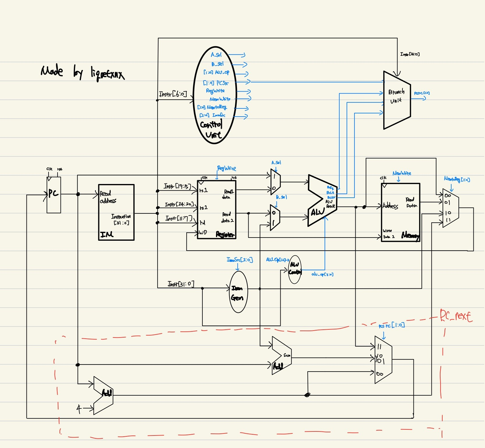

# RV32I-single_cycle_processor

# 0.TL

- **Core** : RV32I single cycle processor (Verilog)
- **Support** : R, I, S, B, J, U type (only lw and sw are supported in loading and store instrution)
- **Addressing** : PC and IM(4KB) is byte-addressed otherwise, Memory(16KB) are word-addressed.
- **Endians** : Little - endians (RISC-V default)
- **Verification** : self-checking C-code excuted by tb_cpu.v
- **Run** : make, (and "gtkwave waves_cpu.vcd")

## Environment :
- 	Linux
-	Icarus Verilog
-	GTKWave for wave form viewing

## Run (manual)
-	make
-	gtkwave cpu.vcd

## Expected output(file)
- Verifiaction_result (pass/fail file)
- trace.log (log data when reg_write, mem_write happen)
- waves_cpu.v (simulation data)

# 1.Project Overview

**Goals**
-	Make single core which can excute c code
-	Clean and readable datapath/control
-	Deterministric simulation
-	Verification-first work flow

**None Goals**
-	No CSR/privilege/interrupt
-	No MUL and DIV for (RV32M)
-	Misaligned access handling

# 2. Architecture

- Block Diagaram

- Top module

	-Control unit

	-Data path

		-PC(register)

		-PC_next

		-Instruction Memory(IM)	

		-Register File

		-ALU

		-ALU_Control

		-Immediate Generation(ImmGen)

		-Memory

		-Branch_Unit

		-Mux 2 to 1

		-Mux 4 to 1

# 3. Endians and Addressing 
## Endians
- Instrution is stored by 1-byte little endians in IM.
	- For example, Instruction `0x01020304` is stored by `04 03 02 01` in IM

## Addressing
### Insturtion Memory(IM)
- PC is byte address (increments by 4 byte) :
    - pc_next = pc + 4 (unless branch/jump)
- IM is stored as 8-bit (1-bytes) ( `mem[1024][8]` )
- Size is `4KB`
- Instruction fetch uses in bytes and by little - endians :
	- pc = current pc address (1bytes)
	- Instr = [8bytes, 8bytes, 8bytes, 8bytes] = [IM[pc+3], IM[pc+2], IM[pc+1], IM[pc]]
-  Therefore pc address must be word-aligned for correct instruction fetch.

### Data Memory
- Data memory is also stored as 32-bit words like IM (array of `mem[word_index]`)
- Size is `16KB`
- Effective address is byte addresses; 
	- DMEM_index = alu_result >> 2
	- It is implemented by DMEM_index = alu_result[11:2]

# 4. Implmented Instructions

> Note: Only **word** load/store are implemented: `lw`, `sw`  
> Byte/halfword memory ops are **not** supported: `lb/lh/lbu/lhu/sb/sh`

| Type | Instructions | Status | Notes |
|---|---|---:|---|
| R | `add`, `sub`, `sll`, `slt`, `sltu`, `xor`, `srl`, `sra`, `or`, `and` | ✅ | Full RV32I R-type ALU ops |
| I (ALU) | `addi`, `slti`, `sltiu`, `xori`, `ori`, `andi`, `slli`, `srli`, `srai` | ✅ | Shift-immediate included |
| I (Load) | `lw` | ✅ | **Word only** |
| S (Store) | `sw` | ✅ | **Word only** |
| B | `beq`, `bne`, `blt`, `bge`, `bltu`, `bgeu` | ✅ | Branch compare + PC redirect |
| U | `lui`, `auipc` | ✅⚠️ | Large constant / PC-relative *AUIPC verification is not contained on verification* |
| J | `jal` | ✅ | Link register writeback |
| I (Jump) | `jalr` | ✅ | Target = `(rs1 + imm) & ~1` |
| RV32M | `mul/div/rem*` | ❌ | Not implemented |

# 5. Verification 

## What this verifies

- Operate cpu by simple c code(*prog.c*) to verification.

- All command except ***AUIPC*** is verified on tb_cpu.vcd
>It is difficult to indicate ***AUIPC*** on C code in small memory(16KB)

## Explanation 
- Verify all command and store its value in `sig[]` array.

### Why I used signature (sig[]) array for verification?**

To verify the CPU behavior without relying on waveform inspection, I used a memory-mapped signature array (sig[]) as a verification output buffer.
The program writes the results of key operations (ALU instructions, branches, loads/stores, jumps, etc.) into sig[], which is fixed at address 0x200 in data memory.
The stack pointer is initialized to 0x4000, so the stack grows downward while keeping the signature region safe from being overwritten.
With this setup, the testbench can simply monitor this small memory region and perform a direct comparison:

Deterministic and scalable testing: Instead of manually tracing internal signals, I can validate many instructions by checking a compact, fixed memory window.

Fast debugging: If a mismatch occurs, the failing signature index immediately shows which step or instruction sequence is incorrect, avoiding long waveform debugging sessions.

Overall, the signature array turns CPU verification into a simple PASS/FAIL memory comparison, making regression testing much more efficient and reproducible.

## Simulation outputs

- **Verification_results**
	- **Target files** indicated verification is corrected. It store simple PASS/FAIL memory comparison.

- trace.log
	- prints register writeback events: pc(hex), reg_indx(deci), wdata(deci)
	- prints store events: pc(hex), mem_addr(hex), wdata(deci)
	- (cycle count is not printed)

- waves_cpu.vcd
	- waveform dump for debugging in GTKWave

# 6. How to Run?
>First of all, you have to install gtkwave, iverilog, gcc compiler. 

>OS is Ubuntu.

## Command
- `make`
	- make all verification files. such as **Verification_results**, trace.log, waves_cpu.vcd.
- 'make dump'
	- make rv32i assembly files on `prog.c` code.
- 'make clean'
	- clean all files from 'make' command